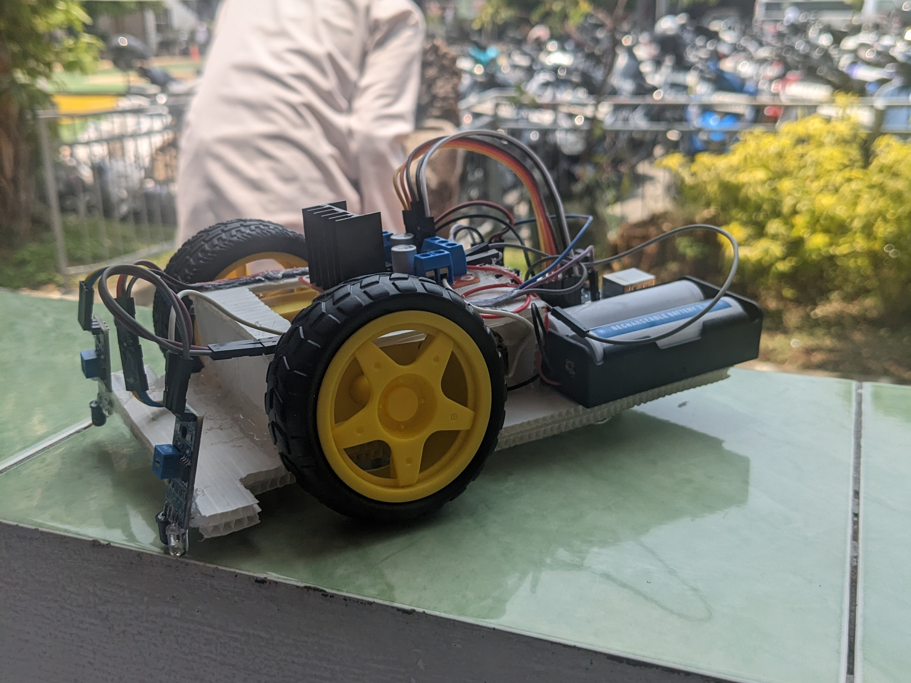
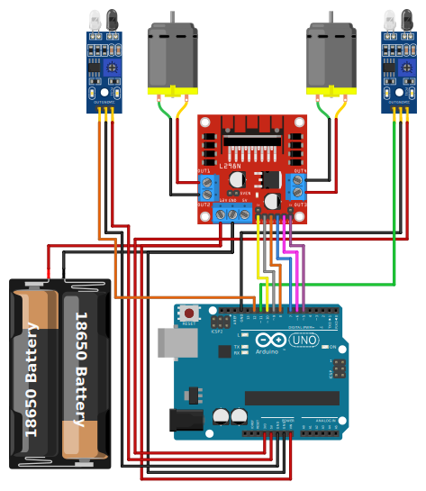
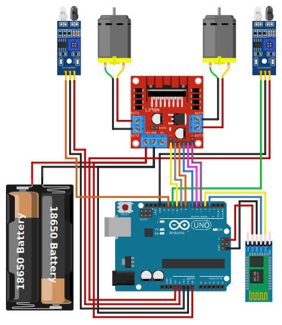

# Bakar Robot
Line following robot with code and schematics

### Components
1. 1 Arduino Uno
2. 2 18650 Batteries (or any combination of batteries but make sure it's more than 6 volts)
3. 2 DC Motors with Gearbox (it won't move without gearbox)
4. 1 L298N Motor Driver
5. 2 Proximity IR Sensors
6. 1 HC-05 Bluetooth Module (if you want bluetooth)
7. Some Jumpers

### Wiring Diagram

    
Click to Open

    

&nbsp;

## Using Bluetooth

### NOTE
The bluetooth part is still VERY buggy, both the arduino and the application code.

To control the robot using bluetooth, use the android application from [Bakar Controller](https://github.com/OpetBrebet/BakarController)

    
Wiring Diagram

    

